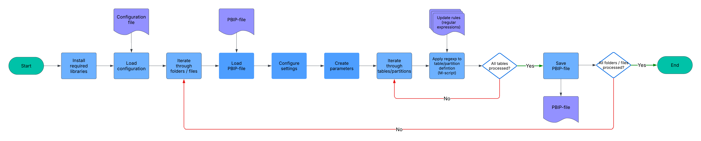

# :rocket: Power BI on Databricks Migration Accelerator

[](https://www.databricks.com)
[](./LICENSE.md)
[](https://learn.microsoft.com/en-us/powershell/)
[](https://learn.microsoft.com/en-us/power-bi/developer/projects/projects-overview)
[](https://github.com/databricks-solutions/powerbi-on-databricks-migration-accelerator/actions/workflows/ci.yml)


Repoint Power BI semantic models from Snowflake / Redshift / SQL Server / Synapse / HMS to Databricks SQL + Unity Catalog - without rebuilding reports.

- **Bulk** - process hundreds of `.pbip` files or whole Power BI workspaces from one CLI.
- **Configuration-driven** - every transformation lives in a single JSON configuration file validated by [Configuration.schema.json](./Configuration.schema.json).
- **Safe** - `-WhatIf` previews, optional dataset backups, transcript logs, and a Pester test suite gating every change.

> [!IMPORTANT]
> This tool does **NOT** implement a conversion of Power BI semantic models and reports to Unity Catalog Metric Views and AI/BI dashboards.


## Contents
- [Why it exists](#bulb-why-it-exists)
- [How it works](#gear-how-it-works)
- [Prerequisites](#clipboard-prerequisites)
- [Quick start](#computer-quick-start)
- [Migration scenarios](#hammer_and_wrench-migration-scenarios)
- [Known limitations](#warning-known-limitations)
- [FAQ](#faq)
- [Contributing](#contributing)
- [Support](#support)
- [License](#license)


## :bulb: Why it exists

Migrating dozens or hundreds of Power BI reports from a legacy warehouse to Databricks SQL is repetitive, error-prone work - every model has near-identical Power Query M code that needs the same edits. This accelerator automates that mechanical layer so you keep your existing Power BI investment and only the data source changes.

It is implemented as a PowerShell module under [src](./src/) and exposed via the [PowerBI-migration-accelerator.ps1](./PowerBI-migration-accelerator.ps1) CLI wrapper. It automates the following at scale:

- creating common semantic model parameters
- modifying Power Query M code by updating data source connections

The accelerator is configuration-driven: the changes applied are defined declaratively in a JSON configuration file.


## :gear: How it works



1. Load prerequisites / libraries required to load and change Power BI files / semantic models.
2. Load configuration file.
3. Iterate through folders / files defined in the configuration file (or Power BI workspaces).
4. Load Power BI Project file (`*.pbip`) or semantic model.
5. Configure semantic model settings as defined in the configuration file.
6. Create parameters as defined in the configuration file.
7. Iterate through tables/partitions in the semantic model.
8. For every partition, apply a set of update rules — regular expressions that update partition M code.
9. Save Power BI Project file or semantic model.


For a deeper dive into runtime flow, configuration precedence, and module layout, see [docs/architecture.md](./docs/architecture.md).


## :clipboard: Prerequisites

- [PowerShell Core](https://learn.microsoft.com/en-us/powershell/?view=powershell-7.5) 7.4.0 or above
- Power BI Premium workspaces - when updating published semantic models
    - Premium / PPU / Embedded / Fabric
    - Contributor, Member, or Admin role
    - XMLA read/write enabled
- [Power BI Desktop](https://www.microsoft.com/de-de/download/details.aspx?id=58494) Nov 2025 or later
    - [Power BI Project + TMDL preview enabled](/images/powerbi-desktop-settings.png)
- Databricks workspace
    - Unity Catalog enabled
    - SQL Warehouse


## :computer: Quick start

```powershell
# 1. Clone the repository
git clone https://github.com/databricks-solutions/powerbi-on-databricks-migration-accelerator.git
cd powerbi-on-databricks-migration-accelerator

# 2. Pick (or modify) a sample config — see ./docs/configuration.md
# 3. Preview every change without writing anything
./PowerBI-migration-accelerator.ps1 -WhatIf -Verbose

# 4. Run for real, optionally pointing at a custom configuration file
./PowerBI-migration-accelerator.ps1 -ConfigFilePath './configurations/Snowflake.json'
```

> [!IMPORTANT]
> **Windows:** right-click [PowerBI-migration-accelerator.ps1](./PowerBI-migration-accelerator.ps1) → Properties → **Unblock** before first run. See [unblock PowerShell script](/images/Unblock-PowerShell-script.png).
>
> **macOS / Linux:** run `chmod +x PowerBI-migration-accelerator.ps1` to grant execute permissions.

<details>
<summary>Sample script output</summary>

```console
2026-05-11T18:28:36 Loading TOM library ...
2026-05-11T18:28:36 Analyzing local folder "./_demo"...
2026-05-11T18:28:36 Skipped file: "Databricks"
2026-05-11T18:28:37 Skipped file: "HMS-incremental-refresh"
2026-05-11T18:28:37 Skipped file: "HMS"
2026-05-11T18:28:37 Skipped file: "Redshift"
2026-05-11T18:28:37 Dataset name: "Snowflake.pbip"
2026-05-11T18:28:37 Dataset ID: ""
2026-05-11T18:28:37 CompatibilityMode:  "Unknown"
2026-05-11T18:28:37 CompatibilityLevel: "1600"
2026-05-11T18:28:37 EstimatedSize:      "0"
2026-05-11T18:28:38 LastUpdated:        "01/01/0001 00:00:00"
2026-05-11T18:28:38 LastProcessed:      "01/01/0001 00:00:00"
2026-05-11T18:28:38 LastSchemaUpdate:   "01/01/0001 00:00:00"
2026-05-11T18:28:38 Updated dataset "Snowflake.pbip" : Data Source Default Max Connections = 20
2026-05-11T18:28:38 Updating dataset "Snowflake.pbip" : adding parameter ServerHostname=adb-2219810816778143.3.azuredatabricks.net
2026-05-11T18:28:38 Updating dataset "Snowflake.pbip" : adding parameter HTTPPath=/sql/1.0/warehouses/a5ad4687dadae274
2026-05-11T18:28:38 Updating dataset "Snowflake.pbip" : adding parameter Catalog=tpch
2026-05-11T18:28:38 Updating dataset "Snowflake.pbip" : adding parameter Schema=sf1
2026-05-11T18:28:38 Analyzing table "MeasuresTable"...
2026-05-11T18:28:39 Analyzing table "orders"...
2026-05-11T18:28:39 Updating table "orders" partition "orders"...
2026-05-11T18:28:39 Analyzing table "lineitem"...
2026-05-11T18:28:39 Updating table "lineitem" partition "lineitem"...
2026-05-11T18:28:39 Analyzing table "part"...
2026-05-11T18:28:39 Updating table "part" partition "part"...
2026-05-11T18:28:39 Analyzing table "customer"...
2026-05-11T18:28:39 Updating table "customer" partition "customer"...
2026-05-11T18:28:39 Analyzing table "region"...
2026-05-11T18:28:39 Updating table "region" partition "region"...
2026-05-11T18:28:40 Analyzing table "nation"...
2026-05-11T18:28:40 Updating table "nation" partition "nation"...
2026-05-11T18:28:40 Analyzing table "orders_with_role"...
2026-05-11T18:28:40 Updating table "orders_with_role" partition "orders_with_role"...
2026-05-11T18:28:40 Saving changes to file "Snowflake.pbip"...
2026-05-11T18:28:40 Saving changes to file "Snowflake.pbip" completed
2026-05-11T18:28:40 Skipped file: "SqlServer"
2026-05-11T18:28:40 Skipped file: "Synapse"
2026-05-11T18:28:40 Analyzing local folder "./_demo" completed
Start Time:   2026-05-11T18:28:36
Finish Time:  2026-05-11T18:28:41
Elapsed Time: 00:00:04.1904580
  TotalWorkspaces: 0
  TotalFolders: 1
  TotalFiles: 1
  UpdatedFiles: 1
  TotalDatasets: 0
  UpdatedDatasets: 0
  CreatedParameters: 4
  TotalTables: 8
  UpdatedTables: 7
  TotalPartitions: 7
  UpdatedPartitions: 7

StartTime           EndTime             Elapsed          Stats
---------           -------             -------          -----
11.05.2026 18:28:36 11.05.2026 18:28:41 00:00:04.1904580 {[TotalWorkspaces, 0], [TotalFolders, 1], [TotalFiles, 1], [Upda…
```
</details>


## :hammer_and_wrench: Migration scenarios

For the configuration structure, see the [Configuration](./docs/configuration.md) page.

The repository ships sample configurations for the following source platforms:

| Source                                         | Config                                              | Power BI template                                  | Notable rules                                             |
|------------------------------------------------|-----------------------------------------------------|----------------------------------------------------|-----------------------------------------------------------|
| [Hive Metastore](./configurations/HMS.md)      | [HMS.json](./configurations/HMS.json)               | [HMS.pbit](./samples-pbit/HMS.pbit)                | Catalog/schema parameterization, native queries support   |
| [Redshift](./configurations/Redshift.md)       | [Redshift.json](./configurations/Redshift.json)     | [Redshift.pbit](./samples-pbit/Redshift.pbit)      | Catalog/schema parameterization, lower-case table names   |
| [Snowflake](./configurations/Snowflake.md)     | [Snowflake.json](./configurations/Snowflake.json)   | [Snowflake.pbit](./samples-pbit/Snowflake.pbit)    | Catalog/schema parameterization, lower-case table names   |
| [SqlServer](./configurations/SqlServer.md)     | [SqlServer.json](./configurations/SqlServer.json)   | [SqlServer.pbit](./samples-pbit/SqlServer.pbit)    | Catalog/schema parameterization, native queries           |
| [Synapse](./configurations/Synapse.md)         | [Synapse.json](./configurations/Synapse.json)       | [Synapse.pbit](./samples-pbit/Synapse.pbit)        | Catalog/schema parameterization, native queries           |
| [Databricks](./configurations/Databricks.md)   | [Databricks.json](./configurations/Databricks.json) | [Databricks.pbit](./samples-pbit/Databricks.pbit)  | Re-parameterization of existing Databricks connections    |

Two additional reference configurations demonstrate alternative orchestration modes:

| Mode                | Walkthrough                                  | Config                                              | Description                                                                |
|---------------------|----------------------------------------------|-----------------------------------------------------|----------------------------------------------------------------------------|
| Local folder        | [Files](./configurations/Files.md)           | [Files.json](./configurations/Files.json)           | Iterate `*.pbip` projects in a local folder, with per-dataset overrides.   |
| Power BI workspace  | [Workspaces](./configurations/Workspaces.md) | [Workspaces.json](./configurations/Workspaces.json) | Iterate semantic models in a Power BI workspace via the XMLA endpoint.     |


## :warning: Known limitations

Please see the [Known limitations](./docs/limitations.md) page for more details.


## FAQ

Please see the [Frequently Asked Questions](./docs/FAQ.md) page for more details.


## Contributing

This repository is maintained by Databricks; external pull requests are not currently accepted, but issues and suggestions are very welcome. See [CONTRIBUTING.md](./CONTRIBUTING.md) for setup, coding conventions, and the regex-rule workflow.

- Bug reports & feature requests: [open a GitHub issue](https://github.com/databricks-solutions/powerbi-on-databricks-migration-accelerator/issues/new/choose)
- Security disclosures: see [SECURITY.md](./SECURITY.md)
- CI runs PSScriptAnalyzer + Pester via [.github/workflows/ci.yml](./.github/workflows/ci.yml)
- The release history lives in [CHANGELOG.md](./CHANGELOG.md)


## Support

Databricks support does not cover this content. For questions or bugs, please [open a GitHub issue](https://github.com/databricks-solutions/powerbi-on-databricks-migration-accelerator/issues) and the team will help on a best-effort basis. For private security disclosures, follow the process in [SECURITY.md](./SECURITY.md).


## License

&copy; 2026 Databricks, Inc. All rights reserved. The source code in this repository is provided subject to the [Databricks License](https://databricks.com/db-license-source). All included or referenced third-party libraries are subject to the licenses set forth below.


<details>
<summary><strong>Third-Party Licenses</strong></summary>

| Library                                | Description               | License    | Source                                                            |
|----------------------------------------|----------------------------|------------|-------------------------------------------------------------------|
| Microsoft.AnalysisServices              | Analysis Management Objects (AMO) | [License](https://go.microsoft.com/fwlink/?linkid=852989)        | [NuGet](https://www.nuget.org/packages/Microsoft.AnalysisServices) |

</details>
