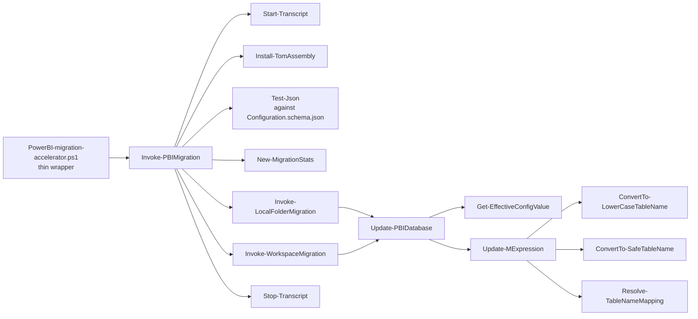

# Architecture

The accelerator is a PowerShell module wrapped by a thin CLI script. The module is loaded from `src/` and exposes two public cmdlets (`Invoke-PBIMigration`, `Update-PBIDatabase`). Everything else is internal.

## Module layout

```
src/
├── PBIMigrationAccelerator.psd1      # manifest (metadata + exports)
├── PBIMigrationAccelerator.psm1      # loader; dot-sources Public/ and Private/
├── Public/                           # exported functions
│   ├── Invoke-PBIMigration.ps1       # CLI entry point
│   └── Update-PBIDatabase.ps1        # per-dataset orchestrator
├── Private/                          # internal helpers
│   ├── Get-EffectiveConfigValue.ps1  # dataset → parent → global fallback
│   ├── Install-TomAssembly.ps1       # installs + loads Microsoft.AnalysisServices
│   ├── Invoke-LocalFolderMigration.ps1
│   ├── Invoke-WorkspaceMigration.ps1
│   ├── New-MigrationStats.ps1        # accumulator for run counters
│   ├── Update-MExpression.ps1        # applies update rules to M code
│   └── Write-MigrationLog.ps1        # colored Information-stream logging
└── Callbacks/                        # regex MatchEvaluator modules
    ├── ConvertTo-LowerCaseTableName.psm1
    ├── ConvertTo-SafeTableName.psm1
    ├── Resolve-TableNameMapping.psm1
    └── Mappings.csv
```

## Runtime flow



## Configuration precedence

Every property is resolved by walking the chain `DatasetConfig → ParentConfig (workspace or folder) → GlobalConfig` and returning the first non-null value. That logic lives in a single place:

```
src/Private/Get-EffectiveConfigValue.ps1
```

## State

No cmdlet mutates global state. Run statistics are collected into a single ordered hashtable produced by `New-MigrationStats`, passed by reference down the call stack, and emitted at the end of `Invoke-PBIMigration` as part of the return object. This makes every function unit-testable in isolation.

## Resource lifetime

- `Start-Transcript` / `Stop-Transcript` bracket the entire run (`Invoke-PBIMigration`).
- `Connect-PowerBIServiceAccount` is paired with `Disconnect-PowerBIServiceAccount` in a `finally`.
- TOM `Server` objects are `Disconnect()`'d and `Dispose()`'d in a `finally` per workspace.
- Dataset processing is wrapped in a per-dataset `try/catch` so one bad model does not abort the rest of a workspace or folder.
